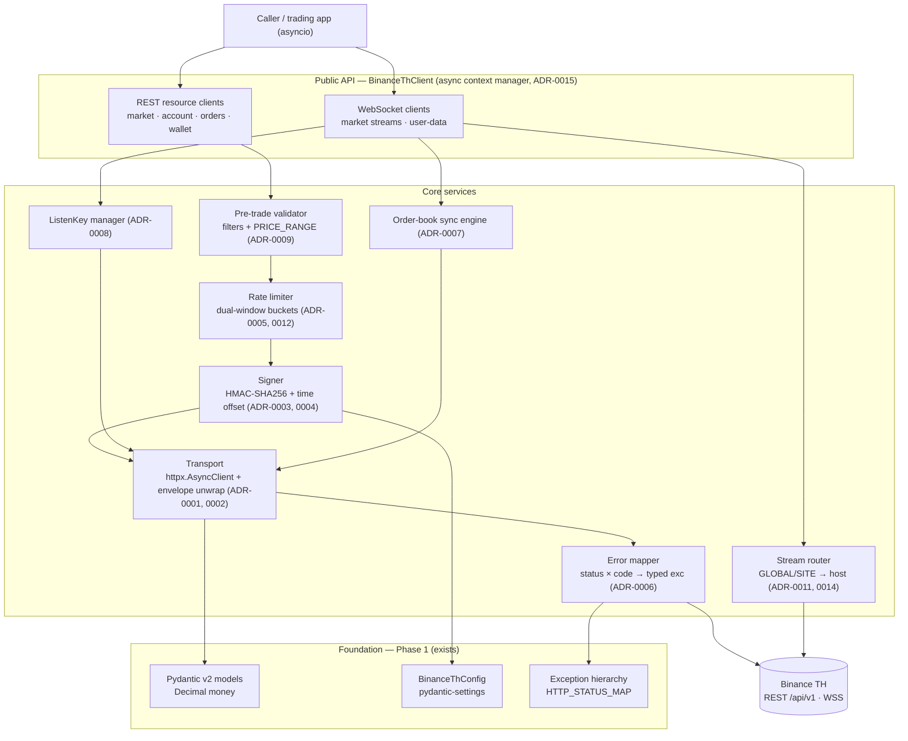

# High-Level Design — `binance-th`

`binance-th` is an async Python client for the **Binance Thailand** REST + WebSocket API. This
document describes the layered architecture, the TH-specific invariants that shape every layer, the
cross-cutting concerns, and the explicit v1 non-goals. Decisions are recorded as ADRs
([adr/](./adr/README.md)); requirements as `FR-*` ([frd.md](./frd.md)); work as `WBS-*`
([wbs.md](./wbs.md)).

## Design goals

Type-safe (Pydantic v2, `mypy --strict`), async-first, correct-over-clever on money and order state,
and faithful to Binance Thailand's regional quirks rather than assuming the global API shape. Phase-1
already ships the **Foundation** (models, exceptions, config); everything above it is planned per the
[ROADMAP](./ROADMAP.md).

## Architecture

Layered, with a single request pipeline (limiter → signer → transport → envelope/error) shared by all
REST resource clients, and a parallel streaming stack (WS client → order-book sync / listenKey
manager) that reuses the same transport for its REST needs.

## Layers

- **Foundation (exists):** `binance_th/models/*` (typed request/response models, `Decimal` money,
  camelCase↔snake_case aliases, array parsers), `binance_th/config.py` (`BinanceThConfig`), and
  `binance_th/exceptions.py` (the typed hierarchy + `HTTP_STATUS_MAP`).
- **Transport (ADR-0001, 0002, 0015):** one `httpx.AsyncClient` per client; centralized envelope
  unwrap and connection/session lifecycle.
- **Auth (ADR-0003, 0004, 0017):** HMAC-SHA256 signer with insertion-ordered params, server-time
  offset, and secret redaction.
- **Reliability (ADR-0005, 0006, 0012):** dual-window rate limiter, error taxonomy with 5xx-UNKNOWN
  reconciliation, and the shared retry/backoff.
- **REST resource clients (ADR-0009, 0011, 0013, 0016):** market, account, orders, wallet — typed in,
  typed out, with pre-trade validation, id minting, and pagination.
- **Streaming (ADR-0007, 0008, 0014):** WS client with `?streams=` multiplex, GLOBAL/SITE routing,
  local order-book sync, and the listenKey manager for user-data.

## TH-vs-global invariants (design constraints)

These are the ways Binance Thailand differs from the global API; each is a constraint the whole design
honors. ⚠ = **ASSUMED**, to be verified against the live docs at implementation.

| Invariant | Constraint | ADR |
|-----------|-----------|-----|
| Response envelope `{code,msg,timestamp,data}`, `code==0`=success | Unwrap in one place; `code!=0`→typed error | 0002, 0006 |
| Endpoints under `/api/v1/` (not `/api/v3/`) | Base paths pinned to `/api/v1` | 0002 |
| ⚠ Single WS host + `?streams=` (`nbstream.binance.th/w3w/wsa/stream`) **vs** config's two hosts | Routing is config data behind a resolver seam | 0014 |
| Account via `accountV2` | Account client targets `/api/v1/accountV2` | — |
| GLOBAL vs SITE symbol types | `type` always surfaced; no assumed parity; type-driven routing | 0011, 0014 |
| ⚠ Dual-window rate limits (~1000/10s + ~6000/1min) | Dual token bucket seeded from `exchangeInfo` | 0005 |
| TH-only `referencePrice`, `executionRules`(PRICE_RANGE), `symbolType` | Pre-trade validation includes PRICE_RANGE | 0009, 0011 |
| ⚠ Signing: HMAC-SHA256, insertion order, raw concat | Signer pins order + raw values; golden vector | 0003 |

## Cross-cutting concerns

- **Async model** — cooperative concurrency; one client owns its connections (ADR-0015).
- **`Decimal` everywhere** — no `float` on any money path (ADR-0001).
- **Error hierarchy & UNKNOWN** — a 5xx on a mutating call is *unknown*, reconciled by client-order-id,
  never blind-retried (ADR-0006, 0013).
- **Time-offset sync** — every signed timestamp carries the server offset (ADR-0004).
- **Idempotent orders** — minted `newClientOrderId` makes every order reconcilable (ADR-0013).
- **Local order-book sync** — snapshot + gap-detected deltas; resync on divergence (ADR-0007).
- **Secret redaction** — signatures/secret/listenKey never logged (ADR-0017).
- **Rate discipline** — proactive dual-window pacing, header-reconciled (ADR-0005).

## v1 non-goals

- **No synchronous API** — async-only (ADR-0001).
- **No margin, futures, or options** — spot only for v1.
- **No built-in strategy/backtesting layer** — this is a transport/typed-model client, not a framework.
- **No persistent storage** — the local order book is in-memory; capture/persistence is a downstream
  concern.
- **No automatic key management/rotation** — credentials come from config/env (ADR-0017).

## Referenced Phase-1 code

`binance_th/models/base.py` (`ResponseModel`/`RequestModel`, array parsers) · `exceptions.py`
(`HTTP_STATUS_MAP`, `get_exception_for_status_code`, 5xx rule) · `config.py` (settings, the WS-host
conflict, `log_requests/log_responses`) · `models/enums.py` (`SymbolType`, `RateLimit*`, `FilterType`)
· `models/orders.py` (auto-sign contract, order `@model_validator`).
